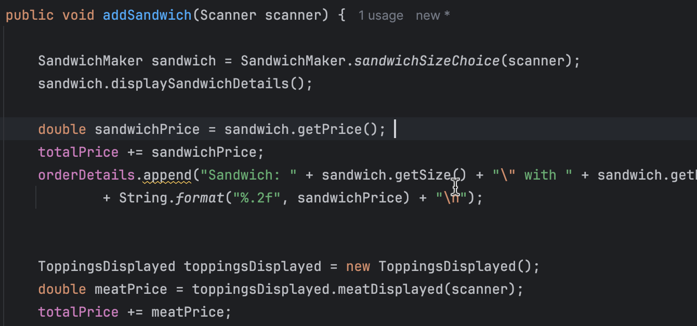

# DELI-cious
## Java CLI Application
This CLI application is a custom sandwich shop called DELI-cious where customers can fully 
customize their sandwich orders.
All the orders will be saved in a Receipts file. The application has several screens such as a
Home Screen, Order Screen.
## Home Screen
This screen gives user the option to add a new order or to exit program completely.

## Order Screen
This screen allows the user the option to choose from different options
such asadding a sandwich, adding a drink, adding chips, checking out and canceling order.

## Diagram

## Interesting Code

